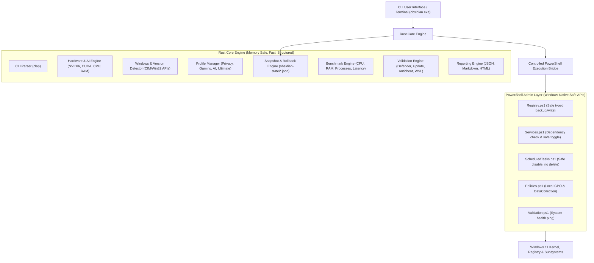

# PROJECT OBSIDIAN — ARCHITECTURAL BLUEPRINT & EXECUTION PLAN

> **"Forge Windows into a Privacy-First AI & Gaming Workstation."**  
> Lead Architect: Antigravity Engineering  
> Version: 1.0.0-alpha  
> Target Systems: Windows 11 Pro (23H2, 24H2, 25H2) x64

---

## 1. Executive Summary & Philosophy

**Project Obsidian** is an open-source, enterprise-grade hybrid optimization suite (Rust Core + PowerShell Administration Layer). It converts a standard Windows 11 installation into a lean, privacy-conscious, high-performance workstation for **Gamers** and **AI Developers**, while adhering strictly to:

$$\text{SECURITY} > \text{STABILITY} > \text{COMPATIBILITY} > \text{PRIVACY} > \text{PERFORMANCE TWEAKS}$$

### Non-Negotiable Tenets:
1. **Zero Debloater Aggression**: Never remove core system components or execute bulk AppX package purge.
2. **Zero Placebo**: Every modification must have documented technical justification (Microsoft Learn, CIS Benchmarks, NVIDIA developer guides).
3. **Zero Breakage Guarantee**: Windows Update, Microsoft Defender, Microsoft Store, anticheat engines (Easy Anti-Cheat, BattlEye, Vanguard), gaming clients (Steam, Epic, Battle.net, Riot), AI virtualization (WSL2, Docker, CUDA), and hardware devices (Wi-Fi, Bluetooth, Audio, Printing) are strictly non-disruptable.
4. **Zero Trust Configuration**: Never assume a registry key, scheduled task, or service exists. Always detect, backup previous state, apply, verify, and log.
5. **Atomic Reversibility**: Any modification made by Obsidian must be 100% reversible via snapshot rollback (`obsidian restore` or `Restore-Obsidian.ps1`), even after system restarts.

---

## 2. System Audit & Environment Baseline

Audit conducted on the host machine:
- **Operating System**: Microsoft Windows 11 Pro (Build 10.0.26200 / 24H2-25H2 stream)
- **Processor**: AMD Ryzen 7 7800X3D (8C/16T, 3D V-Cache architecture)
- **Memory**: 32 GB DDR5
- **Graphics Subsystem**: Dual GPU — AMD Radeon Graphics (iGPU) + NVIDIA GeForce RTX 5070 Ti (Blackwell, dedicated Tensor & RT Cores)
- **Developer Stack**: Python 3.14, WSL2 enabled, Git 2.55.0, Rust 1.98.0
- **Storage & Services**: High-speed NVMe, UEFI Secure Boot, TPM 2.0 active.

---

## 3. Hybrid Architecture (Rust Core + PowerShell Layer)



### Role Division:
- **Rust Core (`obsidian.exe`)**:
  - Command Line Interface (`clap` v4 with derive syntax).
  - Hardware probing (NVAPI/WMI queries for NVIDIA GPU, Tensor Cores, VRAM, CPU architecture).
  - AI ecosystem diagnosis (`obsidian ai doctor`: CUDA toolkit, cuDNN paths, WSL2 status, Docker daemon, Ollama, LM Studio, Python environment).
  - State snapshot manager (`obsidian-state/` with timestamped atomic JSON snapshots).
  - Dry-run analysis (`obsidian analyze` / `obsidian apply --dry-run`).
  - Benchmarking before/after (`benchmark.rs` measuring idle RAM, CPU, active threads, handle count, process count, boot diagnostics).
  - Rollback orchestrator (`obsidian restore`).
  - Structured multi-target logging (`tracing` + `tracing-subscriber` to console & file).
- **PowerShell Enterprise Layer (`powershell/*.ps1`)**:
  - Safe registry modifications with explicit types (`DWord`, `QWord`, `String`, etc.).
  - Service state transition with dependency evaluation (`SafeServiceHelper`).
  - Scheduled task disabling without deletion (`ScheduledTasks.ps1`).
  - Direct integration with Windows Security and Policy namespaces.

---

## 4. Security Review & Threat Matrix

| Component / Subsystem | Proposed State | Risk Rating | Justification & Safeguard |
| :--- | :--- | :--- | :--- |
| **Windows Update (`wuauserv`)** | **NEVER TOUCHED** | CRITICAL | Security updates and driver patches must remain functional at all times. |
| **Microsoft Defender (`WinDefend`)** | **NEVER TOUCHED** | CRITICAL | Antivirus, SmartScreen, and tamper protection must remain fully active. |
| **Core RPC / DCOM / WMI / BITS** | **NEVER TOUCHED** | CRITICAL | Disabling causes systemic OS failure, broken installers, and RPC crashes. |
| **Cryptographic Services (`CryptSvc`)**| **NEVER TOUCHED** | CRITICAL | Required for digital signature verification (games, drivers, Windows updates). |
| **Event Log (`EventLog`)** | **NEVER TOUCHED** | HIGH | Required for system diagnostic stability and security auditing. |
| **Anticheat / Game Clients** | **PRESERVED & VALIDATED** | HIGH | EAC, BattlEye, Vanguard, Steam, Epic, Battle.net need uninhibited access to game processes. |
| **DiagTrack (Telemetry Service)** | **Disabled in Privacy Profile** | LOW | Pure telemetry collection (`Connected User Experiences`). Fully reversible. |
| **WerSvc (Error Reporting)** | **Disabled in Privacy Profile** | LOW | Windows Error Reporting sending crash dumps externally. Reversible. |
| **Compatibility Appraiser** | **Task Disabled** | LOW | `CompatTelRunner.exe` periodic CPU/disk scans. Disabling saves background I/O. |
| **Bing Start Search** | **Policy Disabled** | LOW | Local search remains instantaneous; queries are no longer streamed to Bing servers. |
| **Windows Copilot & Recall** | **Policy Disabled** | LOW | Policy-based disable (`TurnOffWindowsCopilot`, `DisableAIDataAnalysis`); code remains intact. |
| **Delivery Optimization (P2P)** | **Restricted to HTTP-only** | LOW | Prevents outbound bandwidth consumption from uploading updates to arbitrary PCs. |

---

## 5. Development Phases

```text
[X] FASE 1: Auditoría del Sistema y Detección de Herramientas
[X] FASE 2: Diseño de Arquitectura y Plan Maestro (PLAN.md)
[ ] FASE 3: Estructura del Repositorio y Configuración de Cargo/Rust
[ ] FASE 4: Capa de Administración PowerShell (Registry, Services, Tasks, Policies, Validation)
[ ] FASE 5: Núcleo Rust (CLI, Hardware, Snapshot, Rollback, Benchmark, AI Doctor, Modules)
[ ] FASE 6: Scripts Root de PowerShell (Obsidian.ps1, Restore-Obsidian.ps1)
[ ] FASE 7: Testing y Compilación (Cargo check, Cargo test, Pester syntax audit)
[ ] FASE 8: Infraestructura GitHub y Documentación Completa (Top GitHub Open-Source Standard)
```
