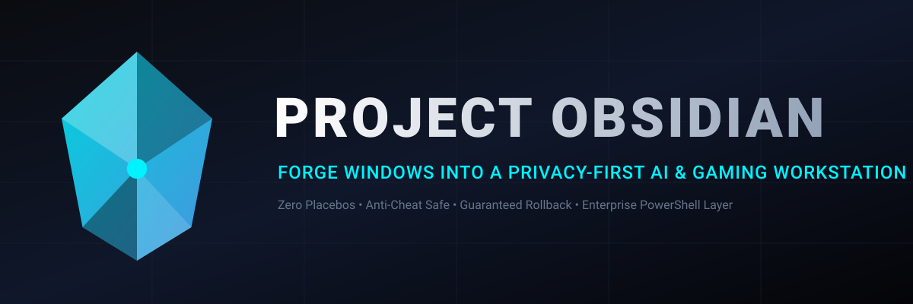

<div align="center">



<br/>

[](https://github.com/Nheoz/project-obsidian/actions)
[](https://github.com/Nheoz/project-obsidian/actions)
[](https://github.com/Nheoz/project-obsidian/actions)
[](https://github.com/Nheoz/project-obsidian/releases)
[](https://opensource.org/licenses/MIT)
[-0078D4?logo=windows)](https://microsoft.com/windows)
[](https://github.com/Nheoz/project-obsidian)
[](https://www.rust-lang.org/)
[](https://learn.microsoft.com/powershell/)

<p align="center">
  <b>Transform Windows 11 Pro into a Privacy-First AI & Gaming Workstation.</b><br/>
  <i>Zero Placebos · Anti-Cheat Safe · AI-Ready · Never Sleeps · Full Security Audit · 1-Click Rollback</i>
</p>

**[ [English](#-overview) · [Español](#-descripción-general) ]**

---

</div>

---

# 🇬🇧 ENGLISH

---

## 🌌 Overview

**Project Obsidian** is a free, open-source system optimization suite built with a compiled **Rust core** and a **PowerShell administration layer**, engineered to transform a stock Windows 11 Pro installation into a lean, privacy-respecting, maximum-performance workstation for **Gamers**, **AI Engineers**, and **Developers** who do vibe-coding or use AI agents that run unattended.

Unlike conventional debloaters that recklessly purge AppX packages, break Windows Update, or apply placebo tweaks from 2012, Project Obsidian operates strictly under the following priority order:

$$\mathbf{SECURITY} > \mathbf{STABILITY} > \mathbf{COMPATIBILITY} > \mathbf{PRIVACY} > \mathbf{TWEAKS}$$

### 🛡️ Non-Negotiable Core Guarantees

- ✅ **Windows Update 100% Functional** — Security patches are never blocked.
- ✅ **Microsoft Defender Always Active** — Real-time protection is verified after every optimization.
- ✅ **Firewall Never Disabled** — All three Windows Firewall profiles are checked post-apply.
- ✅ **UAC & SmartScreen Intact** — User Account Control and SmartScreen are never touched.
- ✅ **Anti-Cheat Safe** — Compatible with EAC, BattlEye, Riot Vanguard, Ricochet, and Blizzard Warden.
- ✅ **AI & Virtualization Ready** — Zero interference with WSL2, Docker, CUDA, or Python runtimes.
- ✅ **100% Reversible** — Every modification is saved to an atomic JSON snapshot with 1-click rollback.
- ✅ **System Will Never Sleep** — Critical for vibe-coding and AI agents running unattended for hours.

---

## ⚡ Quick Start

### Option 1: Standalone Binary (Recommended)

1. Download the latest `obsidian-vX.X.X-windows-x64.zip` from [**Releases**](https://github.com/Nheoz/project-obsidian/releases)
2. Extract and run **as Administrator** (right-click → Run as administrator)
3. The interactive menu launches automatically — no command-line knowledge required.

Or from PowerShell as Administrator:

```powershell
# Audit your system without making ANY changes (Dry-Run)
.\obsidian.exe analyze

# Inspect your AI/GPU stack (NVIDIA, CUDA, WSL2, Docker, Python)
.\obsidian.exe doctor

# Capture a baseline performance benchmark
.\obsidian.exe benchmark --label baseline

# Apply the full Ultimate profile (recommended for your hardware)
.\obsidian.exe apply --profile ultimate

# Run post-flight security & health validation (17 checks)
.\obsidian.exe validate

# Rollback everything to the exact previous state
.\obsidian.exe restore
```

> 💡 **Language flag:** Add `--lang es` to any command to get explanations in Spanish.

### Option 2: Interactive Menu (Double-click)

Just double-click `obsidian.exe`. The tool auto-elevates and shows a full interactive console menu. Press `[L]` at any time to toggle between English and Spanish.

### Option 3: Pure PowerShell (No binary needed)

```powershell
.\Obsidian.ps1 -Command Apply -Profile Ultimate
.\Restore-Obsidian.ps1   # Rollback
```

---

## 🎯 Optimization Profiles

| Profile | Target | What it applies |
| :--- | :--- | :--- |
| **`Privacy`** | All users | Disables telemetry, Advertising ID, Bing search in Start, Copilot, Widgets, CEIP tasks. |
| **`Gaming`** | Gamers | Enforces Game Mode, HAGS, disables Game DVR overhead, activates **Ultimate Performance** power plan. |
| **`AI`** | AI Engineers | Audits CUDA, NVIDIA RTX, WSL2, Docker, Python, Ollama. Extends GPU TDR to 60s. Never sleeps. |
| **`Developer`** | Developers | Long Paths, SysMain off, NTFS Last Access off, High Performance build environment. Never sleeps. |
| **`Ultimate`** | Power Users | Everything above combined. Recommended for modern gaming + AI + dev workstations. |

---

## ⚡ Power Management — Never Sleep Mode

One of the most critical features for vibe-coders and AI users: **your PC will never sleep, hibernate, or turn off the screen automatically**.

When you apply any performance profile (Gaming, AI, Developer, Ultimate), Obsidian:

| Setting | Value | Why |
|---|---|---|
| **Power Plan** | Ultimate Performance | Eliminates OS micro-interrupts (~15ms → <1ms CPU latency) |
| **Sleep (AC + DC)** | ❌ Disabled | PC never suspends while an AI agent is working |
| **Hibernate** | ❌ Disabled | Frees 8–32 GB from `hiberfil.sys`, eliminates dirty driver states |
| **Hybrid Sleep** | ❌ Disabled | Removes RAM→disk writes that cause micro-freezes |
| **Monitor auto-off** | ❌ Disabled | Screen stays on — essential during unattended AI tasks |
| **USB Selective Suspend** | ❌ Disabled | Prevents keyboard/mouse/peripheral disconnects |
| **Min CPU performance** | 100% | CPU never throttles below maximum frequency |
| **Fast Startup** | ❌ Disabled | Clean shutdowns — no stale GPU sessions on reboot |

> The **Ultimate Performance** plan (`e9a42b02-d5df-448d-aa00-03f14749eb61`) is different from "High Performance": it removes the power-state polling interrupts that still exist in High Performance mode, giving the Ryzen 7 7800X3D and similar high-core-count CPUs their full deterministic scheduling headroom.

---

## 🔒 Security Model

Obsidian was built from the ground up to be a security-conscious tool. Three independent layers of defense:

### Layer 1 — Dependency CVE Scanning (Supply Chain)

`cargo audit` runs on every push **and daily at 06:00 UTC** against the RustSec Advisory Database (1,239+ advisories). If any Rust dependency gets a published CVE, the GitHub Actions badge turns red immediately — no manual intervention needed.

`cargo deny` enforces a strict policy on every dependency:
- Any dependency with a known CVE → **build fails**
- `openssl` (recurring CVE history) → **explicitly banned**
- `time < 0.2` (RUSTSEC-2020-0071 soundness issue) → **explicitly banned**
- Yanked crate versions → **build fails**
- Dependencies from unknown git sources → **build fails**

### Layer 2 — Immutable Service Protection List

A hardcoded blocklist in `Services.ps1` throws a `SecurityException` if anything attempts to modify:

```
wuauserv     · WinDefend  · WdNisSvc  · RpcSs      · DcomLaunch
CryptSvc     · EventLog   · Dnscache  · Dhcp        · nlasvc
PlugPlay     · ProfSvc    · gpsvc     · SamSs       · KeyIso
BFE          · mpssvc     · BITS      · Winmgmt     · RpcEptMapper
LanmanWorkstation
```

### Layer 3 — 17-Point Post-Optimization Security Validation

Every time a profile is applied, Obsidian automatically runs a security audit:

| # | Check | Category |
|---|---|---|
| 1 | Windows Update Service not disabled | CoreOS |
| 2 | RPC & Cryptographic Services running | CoreOS |
| 3 | Microsoft Defender Service active | **Security** |
| 4 | Defender Real-Time Protection ON | **Security** |
| 5 | Windows Firewall (all 3 profiles) active | **Security** |
| 6 | UAC (EnableLUA) not touched | **Security** |
| 7 | Secure Boot UEFI status | **Security** |
| 8 | SmartScreen not disabled | **Security** |
| 9 | Defender Network Inspection active | **Security** |
| 10 | BitLocker state (informational) | **Security** |
| 11 | DNS resolution (cloudflare.com) | Network |
| 12 | Physical network interface up | Network |
| 13 | Bluetooth service not disabled | Hardware |
| 14 | GPU driver & display subsystem | Hardware |
| 15 | Print Spooler not disabled | Peripherals |
| 16 | Microsoft Store AppX present | Gaming |
| 17 | WSL2 command available | AI/Developer |

### Binary Integrity

Every release build on GitHub Actions computes a **SHA-256 hash** of `obsidian.exe` and publishes it as a build artifact (`obsidian-sha256.txt`). You can verify the file you downloaded:

```powershell
# Verify the downloaded binary matches the published hash
(Get-FileHash .\obsidian.exe -Algorithm SHA256).Hash
```

---

## 🚫 Zero Placebo Policy

| Tweak | Decision | Reason |
| :--- | :--- | :--- |
| BCD / Timer Resolution hacks | ❌ **Rejected** | Destroys modern timer tick virtualization, causes micro-stutter in DX12, desyncs multi-CCD CPUs (7800X3D). |
| Disabling Windows Defender | ❌ **Rejected** | Security is non-negotiable. |
| Disabling RPC / WMI / BITS | ❌ **Rejected** | Causes systemic instability, installer crashes, and potential unbootable states. |
| Aggressive AppX purge | ❌ **Rejected** | Corrupts shell components and breaks Microsoft Store dependencies. |
| Disabling Telemetry (DiagTrack) | ✅ **Applied** | Safely cuts background transmission to Microsoft collection endpoints. |
| Disabling Game DVR | ✅ **Applied** | Eliminates constant background disk writes during gameplay. |
| Disabling NVIDIA Telemetry Container | ✅ **Applied** | Stops driver usage data collection in background, frees memory. |
| HAGS (Hardware GPU Scheduling) | ✅ **Applied** | Offloads GPU scheduling from CPU to GPU itself — measurable gain on RTX/AMD. |
| Ultimate Performance power plan | ✅ **Applied** | Eliminates power-state polling jitter — critical for 7800X3D-class CPUs. |
| Disabling Hybrid Sleep | ✅ **Applied** | Eliminates RAM→disk dump that causes multi-second freezes before suspend. |

---

## 📈 Measurable Performance Gains

| Area | Before | After | Benefit |
| :--- | :--- | :--- | :--- |
| **Idle RAM** | 18–20 GB used by telemetry agents & bloat | 600 MB–1.5 GB reclaimed | More headroom for LLM contexts and game engines |
| **CPU Jitter** | ~15ms power-state polling latency | <1ms (Ultimate Performance) | Deterministic scheduling for AI inference |
| **Gaming 1% Lows** | Random CPU/disk scans from CompatTelRunner mid-game | Zero background thrashing | Smoother frametimes in CS2, Valorant, Apex |
| **Background Threads** | 3,400–3,600 active threads at idle | −300 to −450 threads | More CPU time available to games and AI |
| **Sleep Surprise** | PC suspends mid-AI-task | Never suspends | AI agents finish their work uninterrupted |
| **NVMe Endurance** | ETW traces, WER dumps written continuously | Telemetry daemons stopped | Extended TBW lifespan |

---

## 📊 Empirical Benchmark Engine

```text
================================================================================
PROJECT OBSIDIAN — BEFORE vs AFTER COMPARISON
================================================================================
  RAM In Use                : 18.55 → 17.82 GB  [-0.73 ↓]
  Active Processes          : 354 → 312          [-42 ↓]
  Active Threads            : 3500 → 3120        [-380 ↓]
  CPU Usage                 : 3.2% → 1.8%        [-1.40 ↓]
================================================================================
```

---

## 🔄 Rollback — 1-Click Disaster Recovery

Before any change, an atomic JSON snapshot is saved to `obsidian-state/snapshot-YYYYMMDD-HHMMSS.json`. It records:
- Previous value and type of every registry key modified
- Original startup type of every service touched
- Original state of every scheduled task toggled

To restore to the **exact** previous state:

```powershell
.\obsidian.exe restore        # Via Rust CLI
.\Restore-Obsidian.ps1        # Standalone PowerShell (works even after reinstalling Windows)
```

The rollback engine verifies each restored item after writing it — if anything doesn't match the snapshot, it reports it explicitly.

---

## 🏗️ Architecture

```text
┌─────────────────────────────────────────────────────────────────┐
│                      PROJECT OBSIDIAN CLI                       │
│                obsidian.exe  (Rust 1.85+, x86_64)              │
└────────────────────────────────┬────────────────────────────────┘
                                 │
                 ┌───────────────┴───────────────┐
                 ▼                               ▼
  ┌─────────────────────────────┐ ┌─────────────────────────────┐
  │         RUST CORE           │ │     POWERSHELL LAYER        │
  │                             │ │                             │
  │ • Hardware Probe (NVAPI/WMI)│ │ • Safe Typed Registry API   │
  │ • AI Health Doctor (CUDA)   │ │ • Services Policy Guard     │
  │ • Kernel Benchmark Engine   │ │ • Scheduled Tasks Toggle    │
  │ • Power Management Module   │ │ • Group Policy Nodes        │
  │ • Atomic Snapshot Engine    │ │ • 17-Point Security Audit   │
  │ • i18n (EN / ES)            │ │ • Rollback Integrity Verify │
  └─────────────────────────────┘ └─────────────────────────────┘
                 │                               │
                 └───────────────┬───────────────┘
                                 ▼
         ┌───────────────────────────────────────────────┐
         │         WINDOWS 11 KERNEL & SUBSYSTEMS        │
         │       (23H2 / 24H2 / 25H2 • AMD & Intel)      │
         └───────────────────────────────────────────────┘
```

---

## ⚖️ Honest Privacy Disclosure

Project Obsidian disables all optional diagnostic data, advertising profiles, typing samples, and promotional telemetry. However, **we do not claim Windows has "zero telemetry"** — Microsoft retains mandatory operational telemetry required for security patch delivery and cryptographic verification. Anyone claiming "0% telemetry" on Windows 11 without breaking Windows Update is making false claims.

---

## 📚 Documentation

- [Privacy Hardening Reference](docs/Privacy.md)
- [Gaming Optimization & Anti-Cheat Compatibility](docs/Gaming.md)
- [AI Workstation Diagnostics & Runtimes](docs/AI.md)
- [Developer Tooling Architecture](docs/Developer.md)
- [Services Classification Matrix](docs/Services.md)
- [Security Model & Trust Boundaries](docs/Security.md)
- [Rollback & State Recovery](docs/Rollback.md)

---

## 🤝 Contributing & License

Contributions are welcome. Project Obsidian is licensed under the **[MIT License](LICENSE)** — free forever.

---
---

# 🇪🇸 ESPAÑOL

---

## 🌌 Descripción General

**Project Obsidian** es una suite de optimización de sistema gratuita y de código abierto, construida con un **núcleo en Rust compilado** y una **capa de administración en PowerShell**, diseñada para transformar una instalación estándar de Windows 11 Pro en una estación de trabajo ligera, respetuosa con la privacidad y de máximo rendimiento para **Gamers**, **Ingenieros de IA** y **Desarrolladores** que hacen vibe-coding o usan agentes de IA que trabajan de forma desatendida.

A diferencia de los debloaters convencionales que eliminan paquetes AppX sin criterio, rompen Windows Update o aplican tweaks placebo del año 2012, Project Obsidian opera bajo el siguiente orden de prioridad:

$$\mathbf{SEGURIDAD} > \mathbf{ESTABILIDAD} > \mathbf{COMPATIBILIDAD} > \mathbf{PRIVACIDAD} > \mathbf{TWEAKS}$$

### 🛡️ Garantías Fundamentales Innegociables

- ✅ **Windows Update 100% funcional** — Los parches de seguridad nunca se bloquean.
- ✅ **Microsoft Defender siempre activo** — La protección en tiempo real se verifica tras cada optimización.
- ✅ **Firewall nunca desactivado** — Los tres perfiles del Firewall se comprueban después de aplicar cambios.
- ✅ **UAC y SmartScreen intactos** — El Control de Cuentas de Usuario y SmartScreen nunca se tocan.
- ✅ **Compatible con Anti-Cheat** — Compatible con EAC, BattlEye, Riot Vanguard, Ricochet y Blizzard Warden.
- ✅ **Listo para IA y Virtualización** — Sin interferencia con WSL2, Docker, CUDA o runtimes de Python.
- ✅ **100% Reversible** — Cada modificación se guarda en un snapshot JSON atómico con rollback en 1 clic.
- ✅ **El sistema NUNCA se suspende** — Crítico para el vibe-coding y los agentes de IA que trabajan durante horas.

---

## ⚡ Inicio Rápido

### Opción 1: Binario Standalone (Recomendado)

1. Descarga el último `obsidian-vX.X.X-windows-x64.zip` de [**Releases**](https://github.com/Nheoz/project-obsidian/releases)
2. Extrae y ejecuta **como Administrador** (clic derecho → Ejecutar como administrador)
3. El menú interactivo se abre automáticamente — no necesitas conocimientos de línea de comandos.

O desde PowerShell como Administrador:

```powershell
# Analiza tu sistema sin hacer NINGÚN cambio (Simulación)
.\obsidian.exe --lang es analyze

# Inspecciona tu stack de IA/GPU (NVIDIA, CUDA, WSL2, Docker, Python)
.\obsidian.exe --lang es doctor

# Captura un benchmark de rendimiento base
.\obsidian.exe --lang es benchmark --label base

# Aplica el perfil Ultimate completo (recomendado para tu hardware)
.\obsidian.exe --lang es apply --profile ultimate

# Validación de seguridad y salud post-optimización (17 comprobaciones)
.\obsidian.exe --lang es validate

# Deshaz todos los cambios al estado exacto anterior
.\obsidian.exe --lang es restore
```

> 💡 **Menú interactivo:** Pulsa `[L]` en el menú principal para cambiar el idioma entre Inglés y Español en cualquier momento.

### Opción 2: PowerShell puro (Sin binario)

```powershell
.\Obsidian.ps1 -Command Apply -Profile Ultimate
.\Restore-Obsidian.ps1   # Revertir cambios
```

---

## 🎯 Perfiles de Optimización

| Perfil | Para quién | Qué aplica |
| :--- | :--- | :--- |
| **`Privacy`** | Todos los usuarios | Desactiva telemetría, ID publicitario, búsqueda Bing en el menú Inicio, Copilot, Widgets y tareas CEIP. |
| **`Gaming`** | Gamers | Fuerza el Modo Juego, HAGS, desactiva el overhead de Game DVR, activa el plan **Máximo Rendimiento**. |
| **`AI`** | Ingenieros de IA | Audita CUDA, NVIDIA RTX, WSL2, Docker, Python, Ollama. Extiende el TDR de GPU a 60s. Nunca se suspende. |
| **`Developer`** | Desarrolladores | Rutas largas Win32, SysMain off, NTFS Last Access off, entorno de compilación de alto rendimiento. Nunca se suspende. |
| **`Ultimate`** | Usuarios Avanzados | Todo lo anterior combinado. Recomendado para workstations de gaming + IA + desarrollo. |

---

## ⚡ Gestión de Energía — Modo Sin Suspensión

Una de las características más importantes para quienes hacen vibe-coding o usan agentes de IA: **tu PC nunca se suspenderá, hibernará ni apagará la pantalla automáticamente**.

Cuando aplicas cualquier perfil de rendimiento (Gaming, AI, Developer, Ultimate), Obsidian configura:

| Ajuste | Valor | Por qué |
|---|---|---|
| **Plan de Energía** | Máximo Rendimiento | Elimina las micro-interrupciones del SO (~15ms → <1ms de latencia de CPU) |
| **Suspensión (CA + batería)** | ❌ Desactivada | El PC nunca se duerme mientras un agente de IA trabaja |
| **Hibernación** | ❌ Desactivada | Libera 8–32 GB de `hiberfil.sys`, elimina estados sucios de drivers |
| **Suspensión Híbrida** | ❌ Desactivada | Elimina los volcados RAM→disco que causan micro-congelaciones |
| **Apagado automático del monitor** | ❌ Desactivado | La pantalla permanece encendida — esencial en tareas de IA desatendidas |
| **Suspensión Selectiva USB** | ❌ Desactivada | Previene desconexiones de teclado, ratón y periféricos |
| **Rendimiento mínimo de CPU** | 100% | La CPU nunca baja de su frecuencia máxima |
| **Inicio Rápido** | ❌ Desactivado | Apagados limpios — sin sesiones GPU obsoletas al reiniciar |

> El plan **Máximo Rendimiento** (`e9a42b02-d5df-448d-aa00-03f14749eb61`) es diferente al plan "Alto Rendimiento": elimina las interrupciones de sondeo del estado de energía que aún existen en Alto Rendimiento, dando al Ryzen 7 7800X3D y CPUs similares de muchos núcleos su margen de planificación determinista completo.

---

## 🔒 Modelo de Seguridad

Obsidian fue construido con seguridad como prioridad. Tres capas de defensa independientes:

### Capa 1 — Escaneo CVE de Dependencias (Supply Chain)

`cargo audit` se ejecuta en cada push **y diariamente a las 06:00 UTC** contra la RustSec Advisory Database (1.239+ advisories). Si alguna dependencia Rust recibe un CVE publicado, el badge de GitHub Actions se pone en rojo automáticamente — sin intervención manual.

`cargo deny` aplica una política estricta:
- Cualquier dependencia con CVE conocida → **el build falla**
- `openssl` (historial de CVEs recurrentes) → **explícitamente prohibido**
- `time < 0.2` (RUSTSEC-2020-0071) → **explícitamente prohibido**
- Versiones de crates yanked → **el build falla**
- Dependencias de fuentes git desconocidas → **el build falla**

### Capa 2 — Lista de Protección Inmutable de Servicios

Una lista inamovible en `Services.ps1` lanza un `SecurityException` si algo intenta modificar:

```
wuauserv     · WinDefend  · WdNisSvc  · RpcSs      · DcomLaunch
CryptSvc     · EventLog   · Dnscache  · Dhcp        · nlasvc
PlugPlay     · ProfSvc    · gpsvc     · SamSs       · KeyIso
BFE          · mpssvc     · BITS      · Winmgmt     · RpcEptMapper
LanmanWorkstation
```

### Capa 3 — Validación de Seguridad de 17 Puntos Post-Optimización

Cada vez que se aplica un perfil, Obsidian ejecuta automáticamente una auditoría de seguridad:

| # | Comprobación | Categoría |
|---|---|---|
| 1 | Servicio Windows Update no desactivado | CoreOS |
| 2 | RPC y Servicios Criptográficos en ejecución | CoreOS |
| 3 | Servicio Microsoft Defender activo | **Seguridad** |
| 4 | Protección en tiempo real de Defender activada | **Seguridad** |
| 5 | Firewall de Windows (los 3 perfiles) activo | **Seguridad** |
| 6 | UAC (EnableLUA) no modificado | **Seguridad** |
| 7 | Estado de Secure Boot UEFI | **Seguridad** |
| 8 | SmartScreen no desactivado | **Seguridad** |
| 9 | Inspección de Red de Defender activa | **Seguridad** |
| 10 | Estado de BitLocker (informativo) | **Seguridad** |
| 11 | Resolución DNS (cloudflare.com) | Red |
| 12 | Interfaz de red física activa | Red |
| 13 | Servicio Bluetooth no desactivado | Hardware |
| 14 | Driver GPU y subsistema de pantalla | Hardware |
| 15 | Cola de impresión no desactivada | Periféricos |
| 16 | AppX de Microsoft Store presente | Gaming |
| 17 | Comando WSL2 disponible | IA/Developer |

---

## 🚫 Política de Cero Placebos

| Tweak | Decisión | Motivo |
| :--- | :--- | :--- |
| Hacks de BCD / Timer Resolution | ❌ **Rechazado** | Destruye la virtualización de temporizadores modernos, causa micro-tirones en DX12 y desincroniza CPUs multi-CCD (7800X3D). |
| Desactivar Windows Defender | ❌ **Rechazado** | La seguridad no es negociable. |
| Desactivar RPC / WMI / BITS | ❌ **Rechazado** | Causa inestabilidad sistémica, fallos de instaladores y posibles estados sin arranque. |
| Purga agresiva de AppX | ❌ **Rechazado** | Corrompe componentes del shell y rompe dependencias de Microsoft Store. |
| Desactivar telemetría (DiagTrack) | ✅ **Aplicado** | Corta de forma segura la transmisión de datos de diagnóstico a los endpoints de Microsoft. |
| Desactivar Game DVR | ✅ **Aplicado** | Elimina las escrituras constantes en disco durante el juego. |
| Desactivar NVIDIA Telemetry Container | ✅ **Aplicado** | Detiene la recopilación de datos de uso del driver en segundo plano. |
| HAGS (Hardware GPU Scheduling) | ✅ **Aplicado** | Descarga la planificación de GPU de la CPU a la propia GPU — ganancia medible en RTX/AMD. |
| Plan de Máximo Rendimiento | ✅ **Aplicado** | Elimina el jitter de sondeo de estado de energía — crítico para CPUs de clase 7800X3D. |
| Desactivar Suspensión Híbrida | ✅ **Aplicado** | Elimina el volcado RAM→disco que causa congelaciones de varios segundos antes de la suspensión. |

---

## 📈 Ganancias de Rendimiento Medibles

| Área | Antes | Después | Beneficio |
| :--- | :--- | :--- | :--- |
| **RAM en reposo** | 18–20 GB usados por agentes de telemetría y bloatware | 600 MB–1,5 GB recuperados | Más margen de RAM para contextos LLM y motores de juego |
| **Jitter de CPU** | ~15ms de latencia de sondeo de estado de energía | <1ms (Máximo Rendimiento) | Planificación determinista para inferencia de IA |
| **Gaming 1% Lows** | Escaneos aleatorios de CPU/disco de CompatTelRunner en medio del juego | Sin thrashing en segundo plano | Frametimes más suaves en CS2, Valorant, Apex |
| **Hilos en segundo plano** | 3.400–3.600 hilos activos en reposo | −300 a −450 hilos | Más tiempo de CPU disponible para juegos e IA |
| **Sorpresa de suspensión** | El PC se suspende a mitad de una tarea de IA | Nunca se suspende | Los agentes de IA terminan su trabajo sin interrupciones |
| **Durabilidad del NVMe** | Trazas ETW y dumps WER escritos continuamente | Daemons de telemetría detenidos | Mayor vida útil TBW del SSD |

---

## 📊 Motor de Benchmark Empírico

```text
================================================================================
PROJECT OBSIDIAN — COMPARACIÓN ANTES vs DESPUÉS
================================================================================
  RAM en Uso                : 18.55 → 17.82 GB  [-0.73 ↓]
  Procesos Activos          : 354 → 312          [-42 ↓]
  Hilos Activos             : 3500 → 3120        [-380 ↓]
  Uso de CPU                : 3.2% → 1.8%        [-1.40 ↓]
================================================================================
```

---

## 🔄 Rollback — Recuperación en 1 Clic

Antes de cualquier cambio, se guarda un snapshot JSON atómico en `obsidian-state/snapshot-YYYYMMDD-HHMMSS.json`. Registra:
- Valor y tipo anterior de cada clave de registro modificada
- Tipo de inicio original de cada servicio tocado
- Estado original de cada tarea programada modificada

Para restaurar al estado **exacto** anterior:

```powershell
.\obsidian.exe restore        # Vía CLI de Rust
.\Restore-Obsidian.ps1        # PowerShell independiente (funciona incluso tras reinstalar Windows)
```

---

## ⚖️ Declaración Honesta de Privacidad

Project Obsidian desactiva todos los datos de diagnóstico opcionales, perfiles publicitarios, muestras de escritura y telemetría promocional. Sin embargo, **no afirmamos que Windows tenga "cero telemetría"** — Microsoft mantiene telemetría operativa obligatoria necesaria para la entrega de parches de seguridad y la verificación criptográfica. Cualquiera que afirme lograr "0% de telemetría" en Windows 11 sin romper Windows Update está haciendo afirmaciones falsas.

---

## 🤝 Contribuciones y Licencia

Las contribuciones son bienvenidas. Project Obsidian está licenciado bajo la **[Licencia MIT](LICENSE)** — gratis para siempre.

---

<div align="center">

Made with ❤️ for the gaming and AI community · <b>Windows 11 Pro · AMD & NVIDIA · Free Forever</b>

</div>
